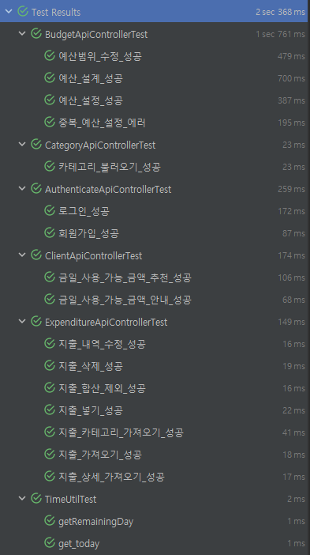
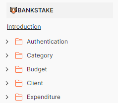
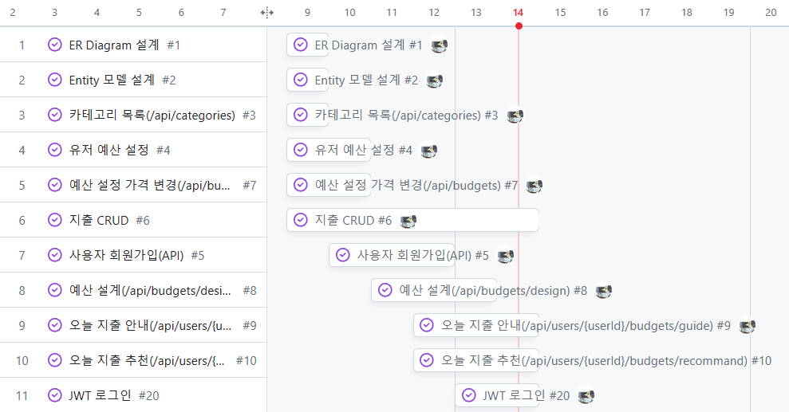
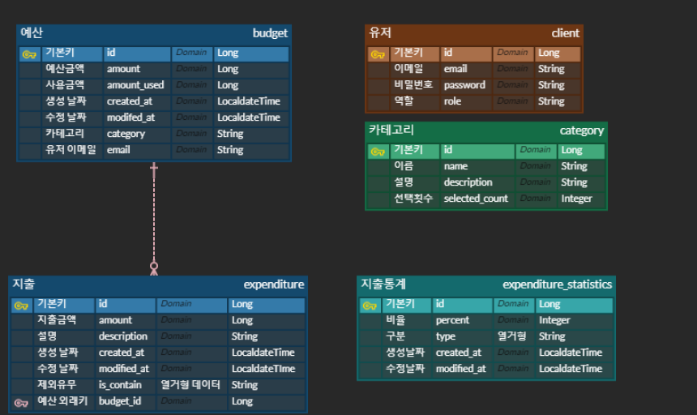

<div align="center">
    
</div>

# 예산 관리 어플리케이션, BankStake
사용자의 개인 재무를 관리하고 지출을 추적하는 애플리케이션 Backend API

<br>

## Table of Contents
- [개요](#개요)
- [Skill](#Skill)
- [Installation](#Installation)
- [Running Tests](#running-tests)
- [API Reference](#api-reference)
- [프로젝트 진행 및 이슈 관리](#프로젝트-진행-및-이슈-관리)
- [ERD](#ERD)
- [TIL 및 회고](#til-및-회고)

<br>

## 개요
**돈 모아서 뭐하겠노? 소고기 사묵겠지.. 당신을 소고기를 지켜줄! BankStake🐮** <br>
본 서비스는 사용자의 개인 재무를 관리하고 지출을 추적하는 데 도움을 주는 애플리케이션입니다. 
이 앱은 사용자들이 예산을 설정하고 지출을 모니터링하며 재무 목표를 달성하는 데 도움이 됩니다.

`주요기능`
> 1. 유저는 본 사이트에 들어와 회원가입을 통해 서비스를 이용합니다.
> 2. 유저는 예산을 설정하고 지출을 모니터링합니다.
> 3. `예산 디자인`을 서비스를 사용하는 유저의 통계를 바탕으로 예산을 설계합니다.
> 4. `예산 가이드`는 사용자의 오늘 지출한 총액과 카테고리 별 금액을 알려줍니다.
>    - 금일 지출 추천 금액과 사용 금액의 차이를 %로 `위험도`를 보여줍니다.

`추후 구현`
> 1. 지출 통계
>   - 다른 유저 대비 소비율
>   - 지난 요일 대비 소비율
>   - 지난 달 대비 총액, 카테고리 별 소비율

<br>

## Skill
언어 및 프레임워크:  <br/>
ORM:  <br/>
데이터 베이스:  <br/>

## Installation

```bash
./gradlew bootjar
./gradlew bootrun
```

## Running Tests
```bash
  ./gradlew test
```

> <br>
> 

## API Reference
> [](https://documenter.getpostman.com/view/18383272/2s9YXo2L9p)<br>
> 

## 프로젝트 진행 및 이슈 관리

> [](https://github.com/users/U-jinLee/projects/1)<br>
> 


## ERD
> 
> - 유저와 예산은 `1:N`의 관계를 가지고 예산과 지출은 `1:N`의 관계
>   - 예산 테이블은 사용한 금액과 관련된 파생 속성을 가지고 있다.
> - 예산 테이블은 생성 날짜를 계산해 한 달이 지나면 다시 생산할 수 있다.
> - 카테고리는 정렬을 위한 선택횟수 파생 속성을 가진다.
> - 지출통계의 통계데이터용 테이블 존재

<br>

## TIL 및 회고
- [LocalDateTime을 통해 기간 정보 뽑아먹기](https://diligent-mangosteen-06d.notion.site/LocalDateTime-9b32b72fef45406b9e2162c0360ecaf5?pvs=4)
- [Optional.of() 대신 Optional.ofNullable() 사용하기](https://diligent-mangosteen-06d.notion.site/Optional-Optional-of-Optional-ofNullable-bd7efda95fa9455c9693180cbfddda81?pvs=4)
- [Class의 @RequestParam은 Method의 @PathVariable에 커버가 된다](https://diligent-mangosteen-06d.notion.site/Class-RequestParam-Method-PathVariable-546969a4558040d7b9f3e340a493255e?pvs=4)
- [QueryDsl 세팅](https://diligent-mangosteen-06d.notion.site/Querydsl-bb19c5e700564401a5bf7d4f2eca29b8?pvs=4)

<br/>